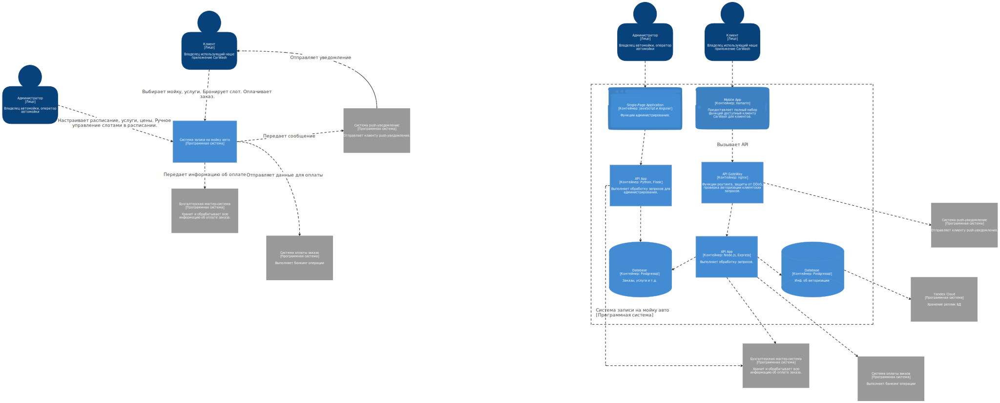
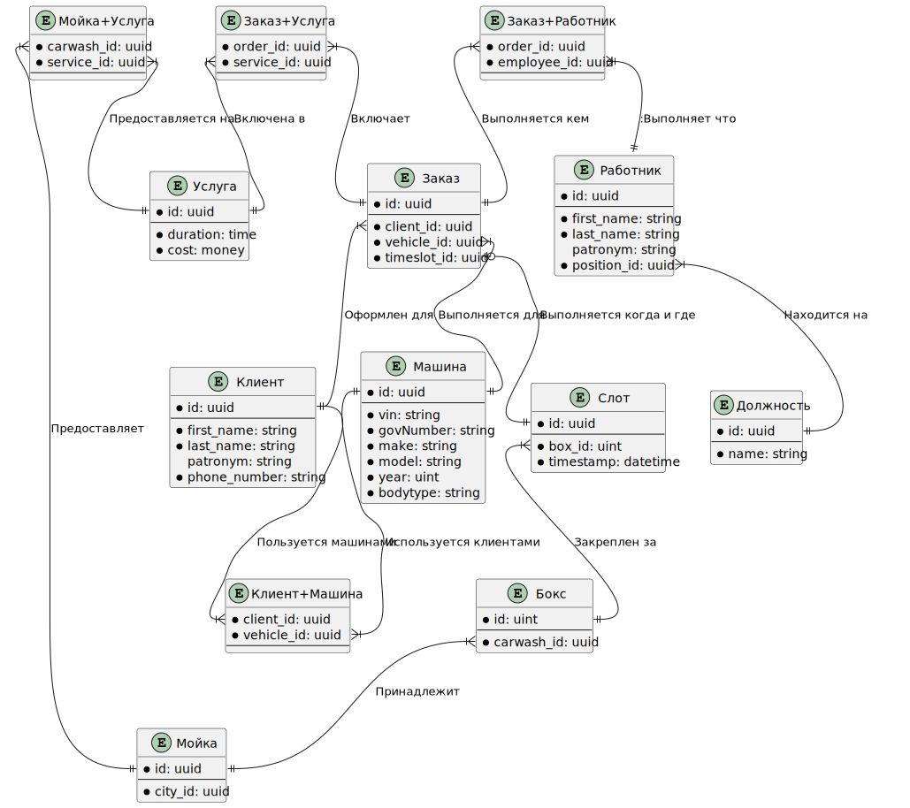
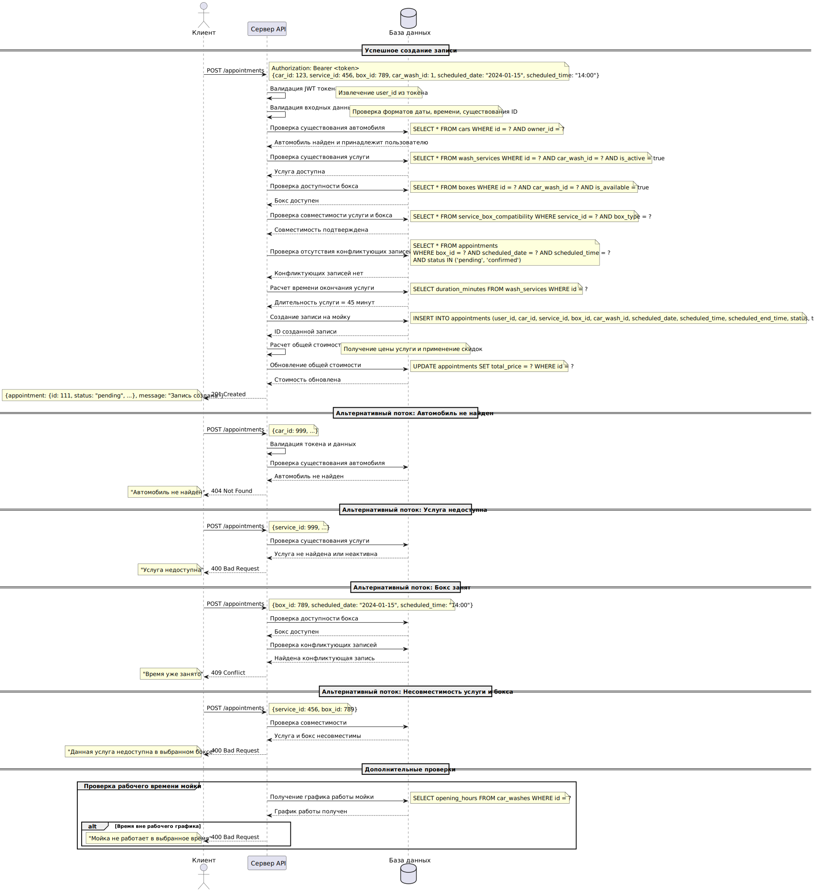
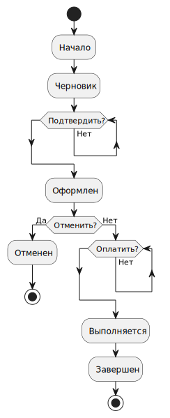
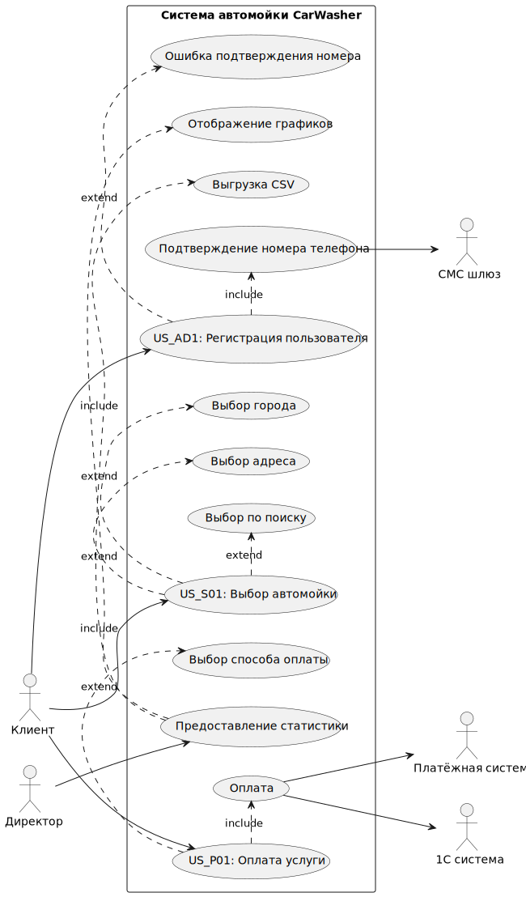

# 🔖 Artifacts index

This document lists the files in the `artifacts/` folder with direct links and previews.

> Notes: PlantUML sources (`*.plantuml`) show their corresponding renders from `uml_renders/` when available.

| File | Type | Preview / Link |
|---|---:|---|
| `api-docs.json` | JSON | ['api-docs.json'](api-docs.json) |
| `c4.svg` | SVG image |  |
| `er_diagram.plantuml` | PlantUML | ['er_diagram.plantuml'](er_diagram.plantuml)     |
| `requirements.md` | Markdown | ['requirements.md'](requirements.md) |
| `sequence_diagrams/appointment.plantuml` | PlantUML | ['sequence_diagrams/appointment.plantuml'](sequence_diagrams/appointment.plantuml)     |
| `sequence_diagrams/auth.plantuml` | PlantUML | ['sequence_diagrams/auth.plantuml'](sequence_diagrams/auth.plantuml)     |
| `status_model.plantuml` | PlantUML | ['status_model.plantuml'](status_model.plantuml)     |
| `user_story_mapping.png` | PNG image |  |
| `use_case.plantuml` | PlantUML | ['use_case.plantuml'](use_case.plantuml)     |

---

If you want, I can also:
- Add this table into the project `README.md` (top-level) and link to this file ✅
- Generate thumbnail versions for faster load (smaller images) 💡
- Add anchors or a small TOC for quicker navigation 🔧

Which of these would you like me to do next?